## Http协议基本概念

特点 ：

1. 底层基于tcp协议实现，面向连接方式安全。
2. 基于请求（request）和响应（response）模型。
3. 无状态协议，对于事务处理没有任何记忆功能。
4. 多次请求无法共享，可以利用cookie和session来解决。
5. http协议数据传输过程中属于同步过程，如果客户端发送请求到服务端，服务端一直没响应，那么可能导致客户端一直阻塞等待。
   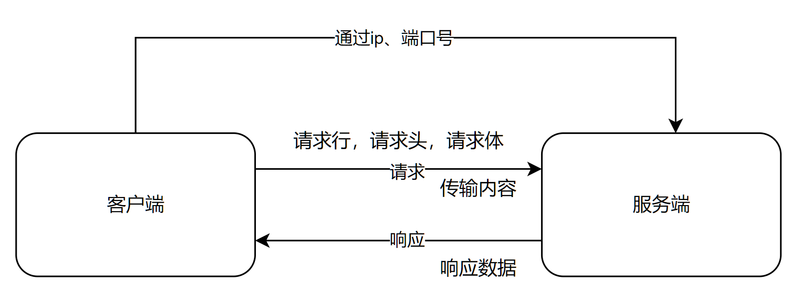

### 请求格式

请求一个网站，以[百度](www.baidu.com)为例子，
访问后按f12或者fn+f12进入开发者工具中，再次刷新网页。
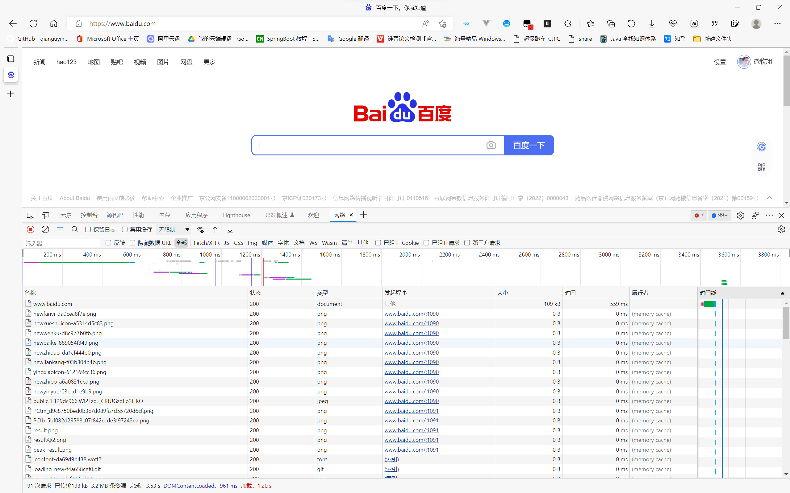

1. 请求行  
   包含请求方法、url、http版本  
     
   其中Get表示请求方法，/表示url，HTTP/1.1表示版本  
   请求方法有：GET、POST、PUT、DELETE等。
2. 请求头和响应头
   以键值对的形式存在  
   [关于常用的请求头和响应头](https://juejin.cn/post/6844903745004765198)
3. 请求体  
   当你需要将数据从客户端（例如浏览器）发送给API时，你将其作为请求体发送。请求体是客户端发送给API的数据。响应体是API发送给客户端的数据。
4. [响应状态码](https://developer.mozilla.org/zh-CN/docs/Web/HTTP/Status)

### 局域网和公网

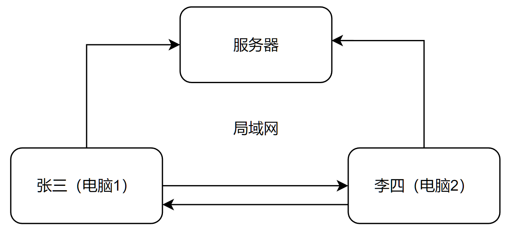
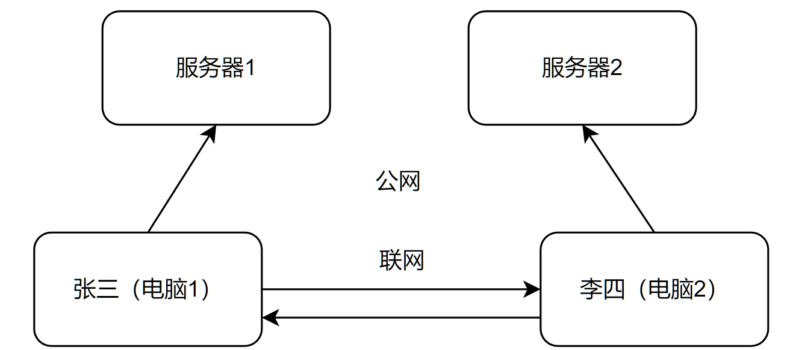

### IP地址和端口

&emsp;&emsp;在终端中输入```ipconfig```命令，可以看到ip地址
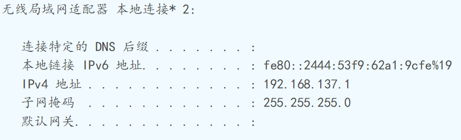
&ensp;&ensp;&ensp;&ensp;在电脑中每一个应用程序都有一个端口号  
&emsp;&emsp;通过```netstat -aon```来查看所有运行的端口号  
&emsp;&emsp;通过```netstat -aon|findstr "3306"```来查看3306这个端口号被PID占用了。  
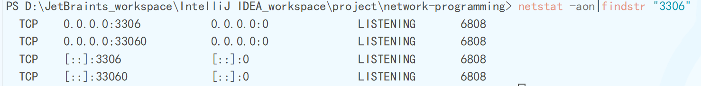
&emsp;&emsp;然后就可以通过PID来查看进程，命令```tasklist|findstr "6808"```
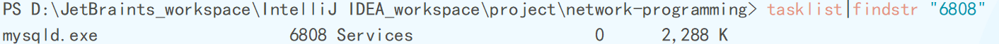
&emsp;&emsp;结束进程的命令为：```taskkill /T /F /PID 6808```  
&emsp;&emsp;在访问网站时都会有IP地址和端口号：183.232.231.174:443  
&emsp;&emsp;使用IP地址和端口号也可以访问到网站。例如现在张三在局域网中想发送给李四一个文件，那么就需要先知道李四电脑的IP地址和发送这个文件的应用程序的端口号。  
&emsp;&emsp;所以IP地址是用来确定对方主机的，端口号是用来确定应用程序的。

### InetAddress用法

```java
    // 参数 ：主机名或者ip地址
    InetAddress address=InetAddress.getByName("www.baidu.com");
		    // 获取ip地址
		    String hostAddress=address.getHostAddress();
		    // 获取名称
		    String hostName=address.getHostName();
		
		    System.out.println(hostAddress);
		    System.out.println(hostName);
```

### dns域名解析

从上面的例子中www.baidu.com就是一个域名，因为ip地址没有规律且很长，所以使用域名解析就可以很好的解决这个问题。

## UDP协议

面向无连接、不可靠的协议，安全系数很低、容易丢包，但是传输速度很快，不需要类似tcp协议三次握手。  
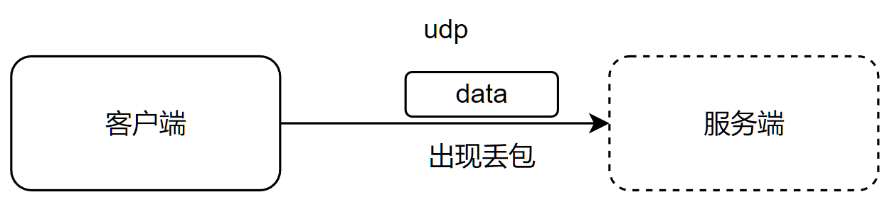

### UDP发送数据

```java
  /**
 * 发送数据
 * @throws IOException
 */
@Test
public void test2()throws IOException{
		// 1. 创建socket对象
		DatagramSocket socket=new DatagramSocket();
		// 2. 提供数据，并将数据封装到数据包中
		byte[]msg="hello".getBytes();
		InetAddress address=InetAddress.getByName("activate.navicat.com");
		DatagramPacket datagramPacket=new DatagramPacket(msg,msg.length,address,8080);
		// 3. 通过socket的发送功能，将数据包发送出去
		socket.send(datagramPacket);
		System.out.println("发送成功");
		// 4. 释放资源
		socket.close();
		}
```

### UDP接收数据

```java
  /**
 * 接收数据
 * @throws IOException
 */
@Test
public void test3()throws IOException{
		// 1. 创建socket对象
		DatagramSocket datagramSocket=new DatagramSocket(8080);
		// 2. 接收数据
		byte[]bytes=new byte[1024];
		DatagramPacket datagramPacket=new DatagramPacket(bytes,bytes.length);
		System.out.println("开始接收数据...");
		datagramSocket.receive(datagramPacket);
		System.out.println("接收数据完毕...");
		// 3. 解析数据
		byte[]data=datagramPacket.getData();
		// 4. 输出数据
		System.out.println(new String(data));
		// 5. 释放资源
		datagramSocket.close();
		}
```

### UDP练习题

&emsp;&emsp;使用UDP协议，客户端可以一直发送数据给服务端， 服务端可以一直
接收客户端发送的数据，如果客户端发送666就会退出客户端程序。

```java
public class UDPTest {
	static final int port = 8080;
}

/**
 * UDP客户端
 */
class UDPClient {
	public static void main(String[] args) {
		try {
			String str = "";
			DatagramSocket datagramSocket = new DatagramSocket();
			InetAddress address = InetAddress.getByName("activate.navicat.com");
			while (!"666".equals(str)) {
				System.out.println("请输入发送的内容");
				Scanner scanner = new Scanner(System.in);
				str = scanner.next();
				byte[] next = str.getBytes();
				DatagramPacket datagramPacket = new DatagramPacket(next, next.length, address, UDPTest.port);
				datagramSocket.send(datagramPacket);
				System.out.println("发送成功，" + str);
			}
			datagramSocket.close();
		} catch (IOException e) {
			throw new RuntimeException(e);
		}
	}
}

/**
 * UDP服务端
 */
class UDPServer {
	public static void main(String[] args) {
		try {
			String str = "";
			DatagramSocket datagramSocket = new DatagramSocket(UDPTest.port);
			int count = 0;
			while (count!=10000) {
				byte[] bytes = new byte[1024];
				DatagramPacket datagramPacket = new DatagramPacket(bytes, bytes.length);
				datagramSocket.receive(datagramPacket);
				byte[] data = datagramPacket.getData();
				str = new String(data).trim();
				System.out.println("接收到的数据为:" + str);
				count++;
			}
			datagramSocket.close();
		} catch (IOException e) {
			throw new RuntimeException(e);
		}
	}
}
```

## TCP协议

&emsp;&emsp;面向连接的可靠协议，通过三次握手来建立连接  
&emsp;&emsp;三次握手 :  
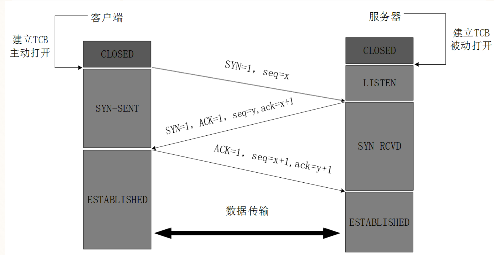
&emsp;&emsp;四次挥手 :  
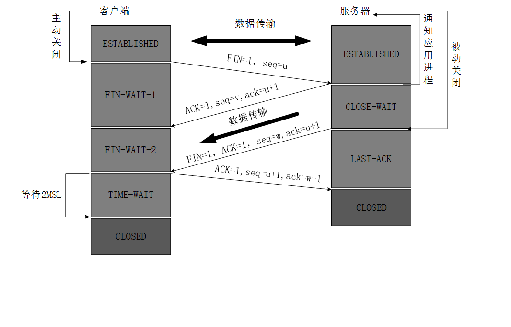

### tcp传输数据

```java
/**
 * tcp 发送数据
 *
 * @throws IOException
 */
@Test
public void test1()throws IOException{
		// 1. 创建socket对象
		Socket socket=new Socket(InetAddress.getByName("activate.navicat.com"),port);
		// 2. 获取输出流对象
		OutputStream outputStream=socket.getOutputStream();
		// 3. 发送数据
		outputStream.write("hello".getBytes());
		// 4. 释放资源
		outputStream.flush();
		outputStream.close();
		socket.close();
		}
```

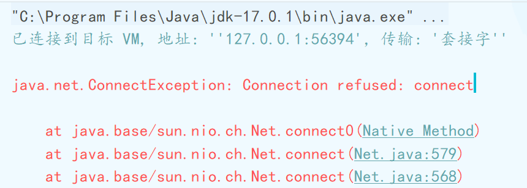  
&emsp;&emsp;出错的原因是：找不到服务端，当前的接收端还没有建立。

### tcp接收数据

```java
  /**
 * tcp 接收数据
 * @throws IOException
 */
@Test
public void test2()throws IOException{
		// 1. 创建接收端socket对象
		ServerSocket serverSocket=new ServerSocket(port);
		// 2. 监听
		Socket socket=serverSocket.accept();
		// 3. 获取数据
		InputStream inputStream=socket.getInputStream();
		byte[]bytes=new byte[1024];
		int read=inputStream.read(bytes);
		// 4. 输出数据
		System.out.println(new String(bytes,0,read));
		// 5. 释放资源
		inputStream.close();
		socket.close();
		serverSocket.close();
		}
```

### tcp小练习

&emsp;&emsp;使用TCP协议，客户端可以一直发送数据给服务端， 服务端可以一直
接收客户端发送的数据，如果客户端发送666就会退出客户端程序。

```java
public class TCPTest {
	static final int port = 8080;
	static String str = "";
}

/** TCP客户端 */
class TCPClient {
	String over = "666";
	
	public static void main(String[] args) {
		// 发送数据
		new TCPClient().send("activate.navicat.com");
	}
	
	/**
	 * 发送数据
	 *
	 * @param url 域名或者ip号
	 */
	public void send(String url) {
		try {
			Socket socket = new Socket(InetAddress.getByName(url), TCPTest.port);
			OutputStream outputStream = socket.getOutputStream();
			while (!over.equals(TCPTest.str)) {
				System.out.println("请输入发送的内容");
				Scanner scanner = new Scanner(System.in);
				TCPTest.str = scanner.next();
				outputStream.write(TCPTest.str.getBytes());
			}
			outputStream.close();
			socket.close();
		} catch (IOException e) {
			throw new RuntimeException(e);
		}
	}
}

/** 服务端 */
class TCPServer {
	
	byte[] bytes = new byte[1024];
	int count = 0;
	
	public static void main(String[] args) {
		// 接收数据
		new TCPServer().accept();
	}
	
	/** 接收数据 */
	public void accept() {
		try {
			ServerSocket serverSocket = new ServerSocket(TCPTest.port);
			Socket socket = serverSocket.accept();
			InputStream inputStream = socket.getInputStream();
			while (count!=10000) {
				int read = inputStream.read(bytes);
				System.out.println("接收到的数据为:" + new String(bytes, 0, read));
				count++;
			}
			inputStream.close();
			socket.close();
			serverSocket.close();
		} catch (IOException e) {
			throw new RuntimeException(e);
		}
	}
}
```

&emsp;&emsp;上述代码在运行多个实例时会出现问题 :   
&emsp;&emsp;无法实现多端的传输。  
&emsp;&emsp;修改代码：  
实现原理
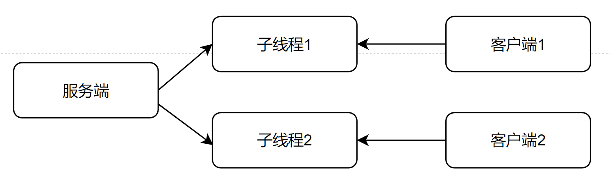
&emsp;&emsp;利用socket.getInputStream()的阻塞效果，创建子线程的时候，
这个子线程如果没有处理数据就会一直阻塞，当处理完一个客户端的数据后继续创建一个子线程（使用线程池）。  
&emsp;&emsp;所以只需要修改接收端的代码即可。

```java
while(count!=10000){
		new Thread(
		()->{
		try{
		InputStream inputStream=socket.getInputStream();
		while(count!=1000){
		int read=inputStream.read(bytes);
		System.out.println("接收到的数据为:"+new String(bytes,0,read));
		count++;
		}
		inputStream.close();
		}catch(IOException e){
		throw new RuntimeException(e);
		}
		})
		.start();
		}
```

### TCP实现服务端验证用户和密码

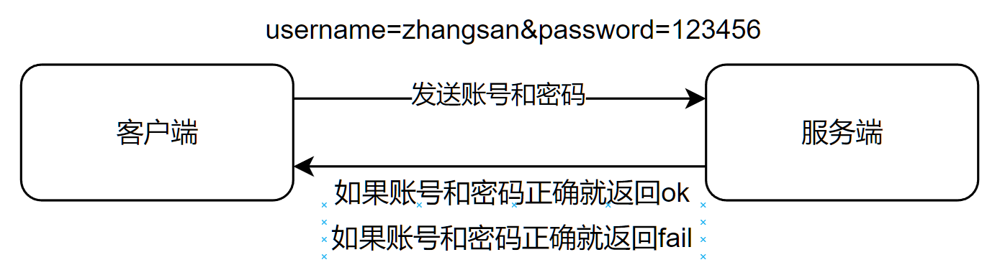

```java
public class TCPTest02 {
	static final int port = 8080;
}

/** TCP客户端 */
class TCPClient02 {
	
	public static void main(String[] args) {
		// 发送数据
		new TCPClient02().send("activate.navicat.com");
	}
	
	/**
	 * 发送数据
	 *
	 * @param url 域名或者ip号
	 */
	public void send(String url) {
		while (true) {
			OutputStream outputStream = null;
			InputStream inputStream = null;
			Socket socket = null;
			try {
				socket = new Socket(InetAddress.getByName(url), TCPTest02.port);
				outputStream = socket.getOutputStream();
				System.out.println("请输入您的账号");
				Scanner scanner = new Scanner(System.in);
				String username = scanner.next();
				System.out.println("请输入您的密码");
				String password = scanner.next();
				String content = "username=" + username + "&password=" + password;
				outputStream.write(content.getBytes());
				byte[] bytes = new byte[1024];
				inputStream = socket.getInputStream();
				int read = inputStream.read(bytes);
				String result = new String(bytes, 0, read);
				if ("ok".equals(result)) {
					System.out.println("登录成功");
				} else {
					System.out.println("登录失败");
				}
			} catch (IOException e) {
				throw new RuntimeException(e);
			} finally {
				try {
					assert outputStream!=null;
					outputStream.close();
					assert inputStream!=null;
					inputStream.close();
					socket.close();
				} catch (Exception e) {
					throw new RuntimeException(e);
				}
			}
		}
	}
}

/** 服务端 */
class TCPServer02 {
	
	public static void main(String[] args) {
		// 接收数据
		new TCPServer02().accept();
	}
	
	/** 接收数据 */
	public void accept() {
		ServerSocket serverSocket = null;
		try {
			serverSocket = new ServerSocket(TCPTest02.port);
			while (true) {
				Socket accept = serverSocket.accept();
				new Thread(
						() -> {
							InputStream inputStream = null;
							OutputStream outputStream = null;
							try {
								inputStream = accept.getInputStream();
								byte[] bytes = new byte[1024];
								int read = inputStream.read(bytes);
								String content = new String(bytes, 0, read);
								String username = content.split("&")[0].split("=")[1];
								String password = content.split("&")[1].split("=")[1];
								outputStream = accept.getOutputStream();
								if ("zhangsan".equals(username) && "123456".equals(password)) {
									outputStream.write("ok".getBytes());
								} else {
									outputStream.write("fail".getBytes());
								}
							} catch (IOException e) {
								throw new RuntimeException(e);
							} finally {
								try {
									if (inputStream!=null) {
										inputStream.close();
									}
									if (outputStream!=null) {
										outputStream.close();
									}
									accept.close();
								} catch (Exception e) {
									throw new RuntimeException(e);
								}
							}
						})
						.start();
			}
		} catch (IOException e) {
			throw new RuntimeException(e);
		} finally {
			try {
				if (serverSocket!=null) {
					serverSocket.close();
				}
			} catch (IOException e) {
				throw new RuntimeException(e);
			}
		}
	}
}
```

### 手写HTTP服务器端

&emsp;&emsp;使用浏览器访问静态资源，例如在项目中的resources中创建一个templates目录，在目录下创建login.html和info.html。  
&emsp;&emsp;HTTP的默认端口为80，所以使用浏览器访问时可以不用写端口号。
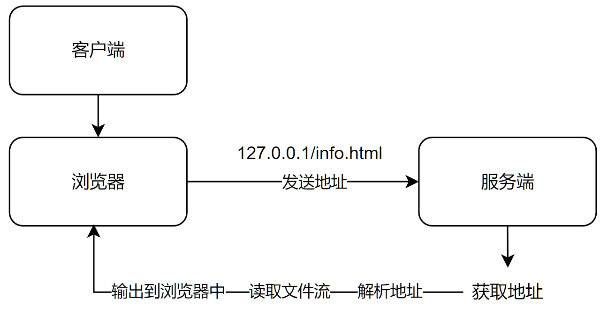

```java
public class HttpTcpServer {
	
	public static void main(String[] args) {
		ServerSocket serverSocket = null;
		try {
			serverSocket = new ServerSocket(80);
			while (true) {
				Socket socket = serverSocket.accept();
				new Thread(
						() -> {
							InputStream inputStream = null;
							FileInputStream fileInputStream = null;
							OutputStream outputStream = null;
							try {
								// 获取文件
								inputStream = socket.getInputStream();
								byte[] bytes = new byte[1024];
								int read = inputStream.read(bytes);
								String content = new String(bytes, 0, read);
								String address = content.split("\r\n")[0].split(" ")[1];
								// 解析文件
								// "D:\\JetBraints_workspace\\IntelliJ
								// IDEA_workspace\\project\\network-programming\\src\\main\\resources\\static"
								File file = new File("src\\main\\resources\\templates");
								String path = file.getAbsolutePath();
								fileInputStream = new FileInputStream(path + address);
								byte[] data = new byte[1024];
								int len = fileInputStream.read(data);
								// 输出文件
								outputStream = socket.getOutputStream();
								outputStream.write(data);
							} catch (IOException e) {
								throw new RuntimeException(e);
							} finally {
								try {
									if (inputStream!=null) {
										inputStream.close();
									}
									socket.close();
								} catch (IOException e) {
									e.printStackTrace();
								}
							}
						})
						.start();
			}
		} catch (IOException e) {
			throw new RuntimeException(e);
		} finally {
			try {
				assert serverSocket!=null;
				serverSocket.close();
			} catch (Exception e) {
				e.getStackTrace();
			}
		}
	}
}
```
